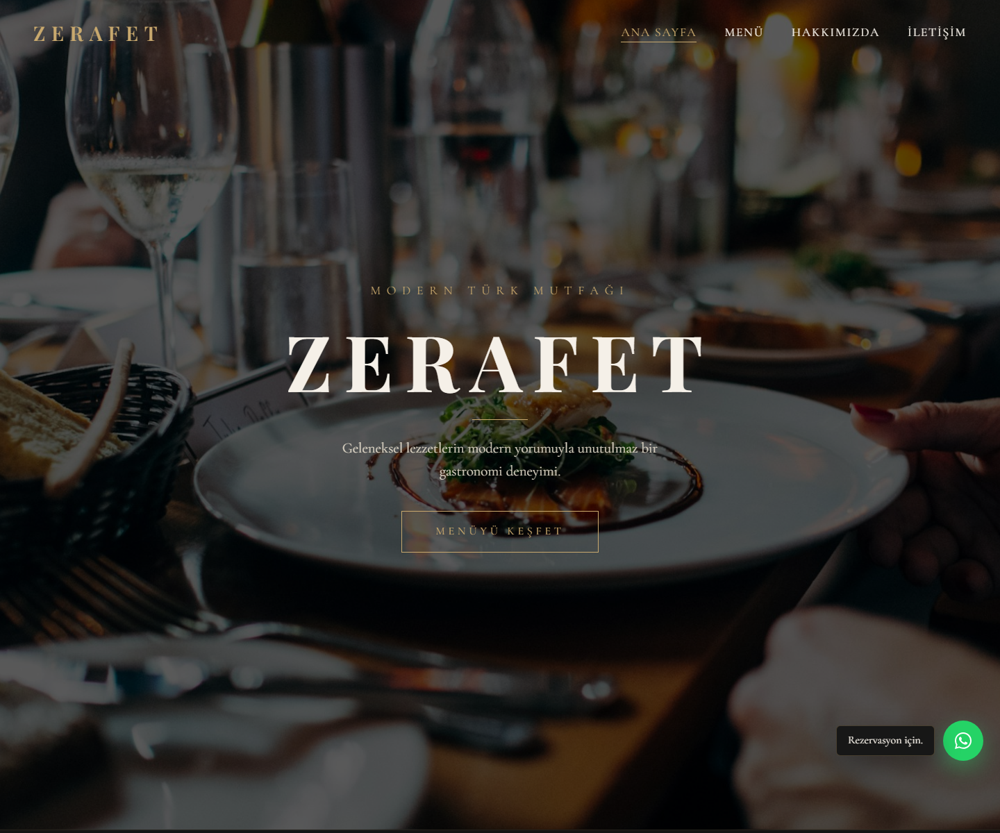

# Zerafet Restaurant Website

A responsive restaurant website built with plain HTML, CSS, and JavaScript. This public reference project is designed for a modern fine dining restaurant with a homepage, menu, about page, contact page, reservation-focused layout, and WhatsApp shortcut.

## Live Preview

[View the live website](https://demo.egementastan.com/Restoran-Kafe/website5-html/)

## Preview



## Features

- Fully responsive layout for desktop, tablet, and mobile screens
- Large restaurant hero section with atmospheric food imagery
- Homepage sections for featured dishes, brand story, and interior preview
- Dynamic menu page powered by `data/menu.json`
- JavaScript fallback menu data for direct local file previews
- Fixed WhatsApp reservation shortcut
- Cookie notice
- Contact page with reservation form layout and map embed
- About page with restaurant story, chef section, and values

## Project Structure

```text
.
|-- about.html
|-- contact.html
|-- index.html
|-- menu.html
|-- preview.png
|-- css/
|   `-- style.css
|-- data/
|   `-- menu.json
|-- images/
|   `-- ...
`-- js/
    |-- main.js
    `-- menu.js
```

## Tech Stack

- HTML5
- CSS3
- Vanilla JavaScript
- Google Fonts

No build step or package manager is required.

## Running Locally

Because the menu data is loaded from a JSON file, using a local server is recommended.

```bash
python -m http.server 4175
```

Then open:

```text
http://127.0.0.1:4175/index.html
```

The pages can also be opened directly from the filesystem. In that case, the menu page uses the embedded fallback data from `js/menu.js`.

## Main Pages

- `index.html` - Homepage
- `menu.html` - Dynamic restaurant menu
- `about.html` - Restaurant story and chef profile
- `contact.html` - Reservation/contact page

## Customization

Menu items can be edited in:

```text
data/menu.json
```

If the site needs to support direct `file://` preview, keep the fallback menu data in `js/menu.js` in sync with the JSON file.

The WhatsApp reservation link is defined in:

```text
js/main.js
```

Look for the `wa.me` URL and replace the phone number/message with your own reservation contact details.

Main colors, typography, spacing, and responsive rules are defined in:

```text
css/style.css
```

## Notes

This is a static frontend reference website. Form submission, booking management, CMS editing, and online payment flows are not connected to a backend by default.
